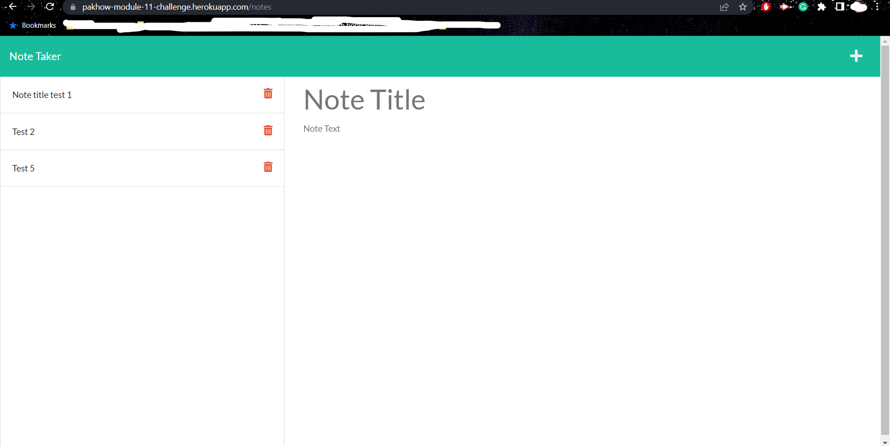

# Module 11 challenge: Note Taker

## Description

This Module 11 Challenge repository was created to complete the Module 11 Challenge of the bootcamp.

This project aims to build the back-end of a note taking web application, with the front-end side of the application
already built, and link both ends together. User can add new note, access saved notes, and delete note in the application. 
Express JS and node JS were used in this project, and is deployed with Heroku.

## Installation

Please make sure to run the command "npm install" to install all required node modules before running the program. 

## Usage

Please run the command "npm start" in terminal to start the local server (with port 3001) for testing, for the deployed
website please visit the link provided below.

Link to the deployed website: https://pakhow-module-11-challenge.herokuapp.com/

## Credits

N/A

## License

N/A
